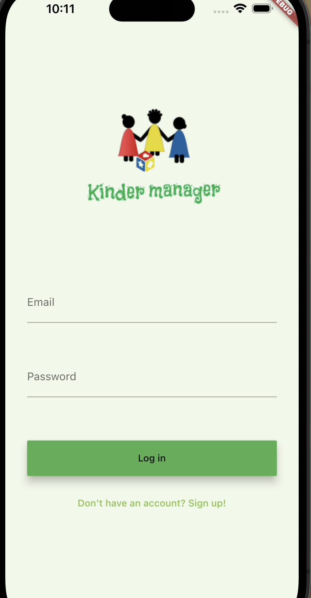

# KinderManager 
A easy way to manage and organize the children in the kindergarten. 
This mobile app is developed as a final project in IDATA2503 Mobile Applications 2022.

## Functions of the app
An authorised user can register a child

 - ARRIVED
 - PICKED
 - ABSENT

using KinderManager. 
 
